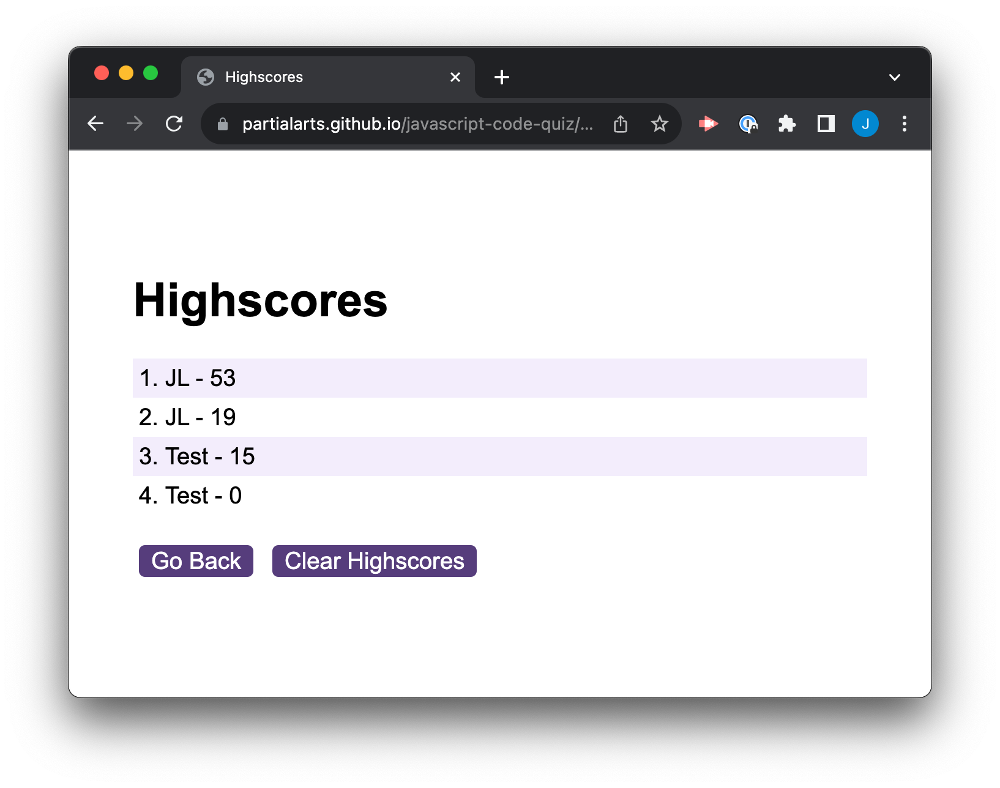
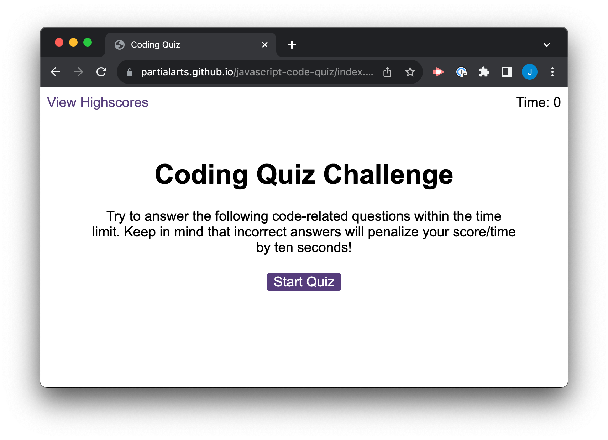

# Front End Bootcamp - Week 6 Challenge - Code Quiz

## Description

The purpose of this project was to build a multiple choice timed code quiz using JavaScript and web API's, storing high scores so that the user can guage their progress as they learn, and a great opportunity to practice the concepts learned on the course. It was the toughest JavaScript project I've made so far and a culmination of all of the concepts I've been learning.

My first step was to identify all the HTML I'd need to manipulate, these were held as variables using `getElementById`. I also defined variables for the timer and index of the current question. The questions were defined in a separate file as an array of objects. The code for the high scores was defined in another file.

I decided to break down the code into functions to make it as versatile as possible, so that it could be used in multiple places. Conditional `if` statements were used to generate a question based on the question index variable. A `for` loop was used to show the answers based on the length of their array, as well as generate the button elements. 

A separate `EventListener` method was used to register a click event on the answer buttons, adding 1 to the question index each time. A conditional `if` statement checks the answer and returns feedback, as well as playing the relevant sound effect.

On the end screen an `EventListener` method was used on the Submit button and `JSON.stringify` was used to store the scores in a new array as a string.

The scores page retrieved the scores from local storage using `JSON.parse`, an `if` statement and `sort()` method were used to sort the scores from highest to lowest and a `for` loop to iterate through and display the scores

I spent some time organising the code once finished to ensure its readability, trying to group related objects together with clear comments.

## Deployed Application

* [JavaScript Code Quiz on GitHub Pages](https://partialarts.github.io/javascript-code-quiz/)

## Usage

To use this web page, you can open index.html inside a browser.

To start the quix, click "Start Quiz" and click on an answer to proceed to the next question. Your score will appear at the end. You can use the form to submit your score to the Highscores page.

## Screenshot

### External Tutorials and Resources

* [JavaScript Array of Objects Tutorial](https://www.freecodecamp.org/news/javascript-array-of-objects-tutorial-how-to-create-update-and-loop-through-objects-using-js-array-methods/)
* [A Complete Guide to Data Attributes](https://css-tricks.com/a-complete-guide-to-data-attributes/)
* [Event: target property](https://developer.mozilla.org/en-US/docs/Web/API/Event/target)
* [How to play audio? (StackOverflow answer)](https://stackoverflow.com/questions/9419263/how-to-play-audio)
* [<audio>: The Embed Audio element](https://developer.mozilla.org/en-US/docs/Web/HTML/Element/audio)
* [Window location.assign()](https://www.w3schools.com/JSREF/met_loc_assign.asp)

## License

MIT - [See LICENSE file in repo](https://github.com/partialarts/javascript-code-quiz/blob/main/LICENSE)
